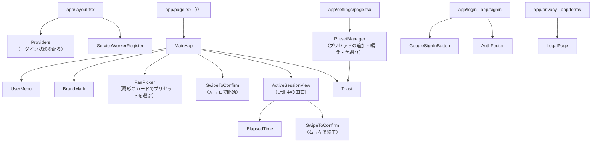
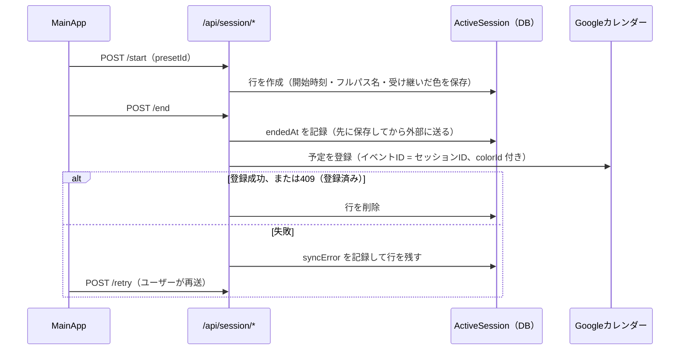

# Stint

スマートフォンの「スライドして電源オフ」に似たスワイプ操作で、タスクの開始と終了を記録するWebアプリケーション。記録された作業時間は、そのままGoogleカレンダーに予定として書き込まれる。

**Live Demo**: https://stint-app-kojiro-tsujis-projects.vercel.app

> ログイン時に「このアプリは Google で確認されていません」という警告画面が表示されます。「詳細」→「stint(安全ではないページ)に移動」で続行できます（個人開発のため、Google審査は未申請です）。

## コンセプト

「時間を測る」ことよりも、**開始と終了の意思表示を明確な身体動作にする**ことに主眼を置いている。ボタンの誤タップで計測が始まる／止まることを防ぎ、「今から始める」「今終わった」という区切りを操作そのものに持たせた。

```
1. Googleアカウントでログイン
2. これから行うタスクをプリセットから選択（最大3階層のツリーを辿る）
3. 左 → 右にスワイプ  … タスク開始（計測スタート）
4. （作業中：経過時間をリアルタイム表示）
5. 右 → 左にスワイプ  … タスク終了
6. 開始〜終了の時間帯がGoogleカレンダーに予定として自動登録される
```

## 設計を貫く3つの原則

| 原則 | 内容 |
|---|---|
| **カレンダーが唯一の記録元** | 完了した作業記録はアプリのDBに持たない。Googleカレンダーだけを正本とすることで、二重管理による不整合を避ける |
| **時刻はサーバーが打つ** | クライアントの時計を信用しない。開始・終了のタイムスタンプは常にサーバー側で確定させる |
| **開始したものは失わない** | 通信断・タブ閉じ・端末変更のいずれでも、計測中のデータが消えないようDB上に保持する |

## 機能

- **Google認証**（Auth.js / OAuth 2.0）
- **プリセット管理**: タスク種別を最大3階層のツリーで登録・編集・アーカイブ・削除
- **扇形のカードピッカー**: プリセットをトランプのように扇状に並べ、横ドラッグで回して選ぶ。中央を通過するたびに吸い付きと振動の手応えがある
- **Googleカレンダーと揃えた色**: プリセットの色はGoogleカレンダーの予定の11色（既定はピーコック）から選ぶ。記録された予定も同じ色でカレンダーに入る。子プリセットに色がなければ親の色を受け継ぐ
- **スワイプ操作**: ドラッグ、または1秒間の長押しでも確定できるアクセシブルな実装
- **経過時間のリアルタイム表示**（タブが非アクティブでもズレない実装）
- **セッション復元**: 別タブ・別端末からアクセスしても進行中の計測を復元
- **止め忘れの自動終了**: 20時間で警告し、24時間を超えた計測は開始+24時間で打ち切ってカレンダーに登録する
- **短すぎる記録の破棄**: 60秒未満の計測は誤操作とみなしてカレンダーに登録しない
- **カレンダー同期のリトライ**: 登録に失敗しても作業時間は失われず、手動で再送可能
- **PWA対応**: ホーム画面に追加してネイティブアプリのように利用可能

## 技術スタック

| レイヤ | 採用技術 |
|---|---|
| フレームワーク | Next.js 16 (App Router, Route Handlers) |
| 言語 | TypeScript |
| スタイリング | Tailwind CSS v4 |
| スワイプUI | Framer Motion |
| 認証 | Auth.js (NextAuth v5, database session strategy) |
| ORM | Prisma |
| バリデーション | Zod |
| データ取得 | SWR |
| データベース | PostgreSQL (Neon) |
| ホスティング | Vercel |
| 外部API | Google Calendar API v3（`googleapis` は使わず `fetch` で直接呼び出し） |

### 技術的なポイント

- **カレンダー登録の冪等性**: セッションIDをそのままGoogleカレンダーのイベントIDとして利用（base32hex準拠の専用ID生成）。通信断による再送があっても、Google側が重複を`409`で弾いてくれるため二重登録が起きない
- **リフレッシュトークンの保護**: Googleは初回認可時にしか`refresh_token`を返さない。再ログイン時に`undefined`で上書きしてしまうとカレンダー連携が恒久的に壊れるため、`signIn`コールバックで既存値を保護している
- **行の有無で状態を表現**: 進行中セッションは列挙型のステータスを持たず、「行が存在し`endedAt`が`null`」＝計測中、「`endedAt`が入っている」＝同期リトライ待ち、「行が削除済み」＝完了、という形でDBスキーマ自体が状態を表す
- **`userId`の一意制約による排他制御**: 1ユーザーにつき進行中セッションは1件までを、アプリケーションロジックではなくDBの`@unique`制約で保証

## ディレクトリ構成

```
src/
├── app/                              # 画面（page.tsx）とAPI（route.ts）。Next.js App Router
│   ├── layout.tsx                    # 全画面共通。Providers と ServiceWorkerRegister を読み込む
│   ├── globals.css                   # 色のトークン（ライト／ダーク）と共通スタイル
│   ├── page.tsx                      # メイン画面。未ログインなら /login へ。中身は MainApp
│   ├── settings/page.tsx             # プリセット管理。中身は PresetManager
│   ├── login/page.tsx                # 新規ユーザー向けの紹介＋ログイン
│   ├── signin/page.tsx               # 登録済みユーザー向けのログイン
│   ├── privacy/page.tsx              # プライバシーポリシー（ログイン不要）
│   ├── terms/page.tsx                # 利用規約（ログイン不要）
│   └── api/
│       ├── auth/[...nextauth]/       # Auth.js のエンドポイント
│       ├── presets/route.ts          # GET 一覧（ツリー） / POST 作成
│       ├── presets/[id]/route.ts     # PATCH 編集・移動・アーカイブ / DELETE 削除
│       ├── session/route.ts          # GET 進行中セッション（24時間超えならここで自動終了）
│       ├── session/start/route.ts    # POST 計測開始
│       ├── session/end/route.ts      # POST 計測終了 → カレンダー登録
│       └── session/retry/route.ts    # POST 同期に失敗したセッションの再送
├── components/                       # 画面の部品（BrandMark・LegalPage・AuthFooter 以外はクライアントコンポーネント）
├── lib/                              # サーバー側の処理と、画面・APIで共有するロジック
└── types/index.ts                    # 共有の型と定数（最大階層、最短記録時間、24時間上限など）
prisma/
├── schema.prisma                     # DBスキーマ
└── migrations/
public/
├── manifest.webmanifest              # PWAの設定
├── sw.js                             # Service Worker
└── icons/
```

### `src/lib/` の役割

| ファイル | 役割 |
|---|---|
| `auth.ts` | Auth.js の設定。Googleログイン、`refresh_token` の保護、Prismaアダプタの委譲 |
| `prisma.ts` | Prismaクライアント（開発中のホットリロードで接続が増えないよう使い回す） |
| `google-token.ts` | DBに保存したトークンから有効なアクセストークンを取り出す（期限切れなら更新） |
| `google-calendar.ts` | Calendar API に予定を登録する。401なら1回だけトークンを更新して再試行 |
| `finish-session.ts` | 計測の終了処理。手動終了と24時間の自動終了で共通 |
| `preset-tree.ts` | プリセットの行をツリーに組み立てる、フルパス名や受け継いだ色を求める |
| `colors.ts` | Googleカレンダーの11色と既定色、色コード→`colorId` の変換 |
| `validations.ts` | APIの入力チェック（Zod） |
| `event-id.ts` | カレンダーのイベントIDに使える形式（base32hex）のID生成 |
| `session-dto.ts` | DBのセッション行を画面に返す形に変換 |
| `api-error.ts` | APIのエラーレスポンスを共通の形にそろえる |
| `fetcher.ts` | SWR 用の fetch ラッパー |

## コンポーネントの関係

### 画面ごとの構成



### `MainApp` の画面の切り替え

`MainApp` がメイン画面の司令塔で、`GET /api/session` の結果によって表示を切り替える。

| サーバーの状態 | 表示 |
|---|---|
| 進行中のセッションがない | `FanPicker` でプリセットを選び、`SwipeToConfirm` で開始 |
| セッションがあり `endedAt` が空 | `ActiveSessionView`（経過時間と、終了用のスワイプ） |
| セッションがあり `endedAt` が入っている | `SyncPendingView`（同期失敗の案内と再送ボタン） |
| Googleの再認可が必要（`REAUTH_REQUIRED`） | `ReauthModal`（再ログインすると自動で再送する） |

`SyncPendingView` と `ReauthModal` は `MainApp.tsx` の中で定義している小さな部品。

- `FanPicker` は選んだプリセットを `onSelect` で `MainApp` に返すだけで、APIは呼ばない。開始・終了・再送のAPI呼び出しはすべて `MainApp` に集めている
- `SwipeToConfirm` は汎用の部品で、向き（`start` / `end`）とラベル、確定時の処理を受け取る
- プリセット一覧は `MainApp` と `PresetManager` の両方が SWR の同じキー（`/api/presets`）で読む

### 記録の流れ（開始からカレンダー登録まで）



`finish-session.ts` は終了時刻の記録と破棄判定（60秒未満）を受け持ち、実際の登録は `google-calendar.ts` に任せる。24時間を超えた計測は `GET /api/session` を呼んだときに同じ `finishSession` で自動終了する。

## ローカルでの動かし方

### 前提

- Node.js 20+
- PostgreSQL（[Neon](https://neon.tech) の無料枠、または `npx prisma dev` でローカルに一時的なPostgresを起動可能）
- Google Cloud Console のプロジェクト（OAuthクライアント）

### セットアップ

```bash
npm install
cp .env.example .env
# .env を編集（下記参照）
npx prisma migrate dev
npm run dev
```

ローカルのDBに `npx prisma dev` を使う場合は、PCを再起動するなどで止まっていることがある。ログインで `error=Configuration` になったら、まずDBが動いているか確認する。

```bash
npx prisma dev ls              # 状態を確認（not_running なら止まっている）
npx prisma dev start default   # 起動
```

### 環境変数（`.env`）

```bash
DATABASE_URL="postgresql://..."     # 末尾に &pgbouncer=true を推奨（下記の詰まりポイント参照）
AUTH_SECRET="..."                   # openssl rand -base64 32
AUTH_URL="http://localhost:3000"
AUTH_GOOGLE_ID="....apps.googleusercontent.com"
AUTH_GOOGLE_SECRET="..."
```

### Google Cloud Console 側の設定

1. OAuth 2.0 クライアントID（種類: ウェブアプリケーション）を作成
2. 承認済みリダイレクトURI: `{AUTH_URL}/api/auth/callback/google`
3. Google Calendar API を有効化
4. OAuth同意画面のスコープに `calendar.events` を追加
5. 公開ステータスを「本番環境」に変更（「テスト」のままだとリフレッシュトークンが7日で失効する）

## デプロイ

Vercel + Neon を想定。`vercel-build`スクリプトが`prisma migrate deploy`を自動実行するため、環境変数さえ揃えれば`git push`だけでスキーマも追従する。

```json
"vercel-build": "prisma migrate deploy && next build"
```

## つまずいたポイント（開発ログ）

- **PgBouncer経由の接続で`prepared statement already exists`エラー**: サーバーレス環境やコネクションプーラー経由だと、Prismaのプリペアドステートメントが衝突することがある。`DATABASE_URL`の末尾に`&pgbouncer=true`を付けて解決
- **Googleの`refresh_token`が2回目のログインから消える**: `prompt=consent`を付けない設計にした副作用。`signIn`コールバックで「新しい値が来たときだけ上書きする」（`??`演算子）ガードを入れないと、再ログインのたびにカレンダー連携が壊れる
- **本番環境限定の`There is a problem with the server configuration`エラー**: 2つの問題が重なっていた。(1) VercelプロジェクトのGit連携が、実際にpushしていたリポジトリとは別の古いスナップショットを見ていたため、修正が本番に反映されていなかった。(2) 連携を直して初めて最新コードが本番に乗ったところ、Auth.jsのモデル名を`Session`にリネームして`@auth/prisma-adapter`をそのまま渡す「標準的な」構成が、Vercelのサーバーレス環境でだけ失敗することが判明。ローカルの直接クエリでは再現せず、原因の完全特定はできなかったが、実際に動作実績のある「独自モデル名+Proxyで委譲する」構成（`src/lib/auth.ts`）に戻すことで解決した

## v1でやらないこと

- 一時停止・再開機能
- 複数タスクの同時進行
- アプリ側での作業履歴の保持（Googleカレンダーが唯一の記録元）
- オフライン対応
- Google OAuthアプリ審査（個人利用の範囲を超えたら検討）
